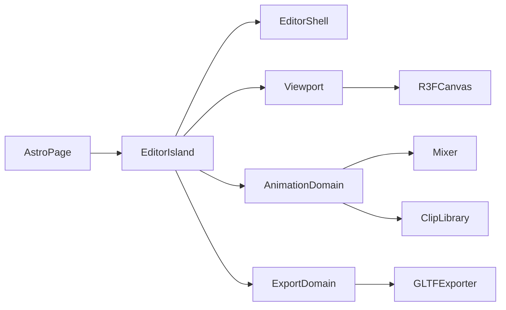

# Design — current

Architecture for the GLB Character & Animation Editor MVP.

## High-level

- [`src/pages/index.astro`](../../src/pages/index.astro) mounts `EditorSidebar` and `EditorPreview` as `client:only="react"` islands
- Domains: `editor-shell`, `viewport`, `animation`, `export` under `src/modules/`

## Assets

| Asset              | Role                                                                                  |
| ------------------ | ------------------------------------------------------------------------------------- |
| Model GLB/GLTF     | Skinned mesh + skeleton; single loaded model at a time                                |
| Animation GLB/GLTF | Source of `AnimationClip`s only; mesh payload ignored or discarded after clip extract |

Clips bind to the loaded model. Track names must resolve to bones/nodes on that skeleton. Mismatch → user-visible error (no retarget).

## Model load

1. User picks one `.glb` / `.gltf` (File API)
2. Adapter parses via imperative `GLTFLoader` and a blob URL (`viewport/adapters`)
3. Validate skinned mesh + skeleton; else set error state and do not mount a broken graph
4. Replace any previously loaded model (single model at a time); dispose the previous scene graph

Empty overlay when idle; clear error copy on parse failure or missing skeleton. After a successful load, camera frames the model AABB from a fixed three-quarter elevated angle (`computeModelFraming` + `DEFAULT_VIEW_OFFSET` in `viewport/constants/camera.ts`; spacing in `viewport/services/model-framing.ts`).

Do not add a second debug canvas, FPS overlay render path, or smoke-test scene that bypasses the editor viewport lifecycle.

## Playback

- One `AnimationMixer` rooted on the model scene graph
- Active clip → one `AnimationAction` (cross-fade later = out of scope)
- Scrubber sets mixer time; Play/Pause/Stop and loop map to action / mixer APIs
- Speed: `mixer.timeScale` for live playback
- Switching active clip stops the previous action and plays the new one

## Animation import

1. User selects one or more `.glb` / `.gltf` files; adapter loads each and collects `animations` into library entries (stable id + display name + clip) — file meshes are never shown
2. Validate each clip's track targets against the loaded character node/skeleton map; missing/unknown bones → the entry is marked errored with user-visible copy (no retargeting, no automatic vendor prefix rewriting)
3. Re-validate entries when the character is replaced or removed so stale clips are never silently played on a mismatched rig
4. Sidebar **library** lists each entry with Replace / Remove (same pattern as the model row). Replace re-picks one file and updates **that** entry only (first clip in the file; keep the entry id). Remove drops the entry; if it was active, select the next ready clip or clear selection
5. Preview chrome owns active-clip selection plus Play / Pause / Stop / loop and the scrubber; those controls stay disabled until a character is loaded and at least one valid clip exists
6. Preview layout: viewport fills remaining height (`flex-1 min-h-0`); playback bar is a shrink-to-content footer under the canvas (not a fixed magic height overlapping the scene)

## Trim

1. Clone active clip
2. Call `trim(start, end)` on the clone
3. Replace the library entry’s working clip with the clone
4. Keep the pre-trim clone recoverable for the session (restore control or retain original reference)

## Time scale on export (US-5 contract)

Playback uses `mixer.timeScale` only. On export, **bake** the current speed into track times / clip duration so the downloaded GLB plays at the edited speed in other viewers (no reliance on runtime `timeScale`).

## Keyframe write (US-4)

1. Pause (or scrub) so `mixer.time` is the target timestamp
2. Raycast → select bone or mesh; attach TransformControls
3. On “Save Keyframe at Current Time”:
   - Read selection local position, quaternion, scale
   - Find or create `VectorKeyframeTrack` / `QuaternionKeyframeTrack` for that node on the active clip
   - Insert or update values at `mixer.time` (keep times sorted)
4. Rebind / update the mixer action so the edit is audible on next play

## Viewport

- Full-bleed R3F `Canvas` with lights; orbit / pan / zoom via `OrbitControls`
- World XYZ axes at the origin with metre rulers on +X/+Y (major `Nm`, minor `0.1` ticks; `viewport/constants/world-axes`) for orientation
- Dark infinite ground grid at `y = 0` (1 m cells, stronger section lines; `viewport/constants/ground-grid`) plus soft contact shadow under the model (`ContactShadows`)
- TransformControls for selected object; modes translate / rotate / scale as needed for keyframe capture
- Collapsible sidebar docks beside the canvas (`editor-shell`); collapse/expand with labelled chevron controls

## Export

- `GLTFExporter` with animations array = all library clips in their current edited form + model scene
- Trigger browser download of `.glb` binary

## Layering rules

- Pure clip math (insert keyframe, sort times, bake scale) in `animation/services` or `utils` without importing `three` types when practical; adapters wrap Three objects at the boundary
- Loaders and exporter live in `adapters/`
- UI state for sidebar vs hot-path mixer time: avoid re-rendering the canvas every frame from React state — prefer refs for mixer clock, promote to state only for labelled UI
