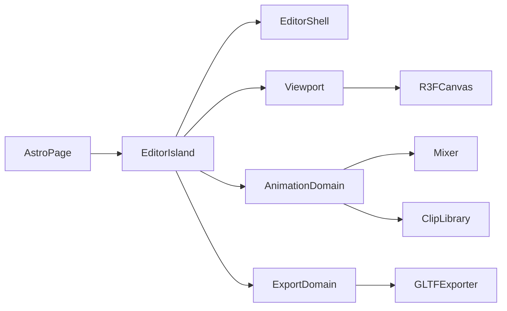

# Design — current

Architecture for the GLB Character & Animation Editor MVP.

## High-level

- [`src/pages/index.astro`](../../src/pages/index.astro) mounts `EditorSidebar` and `EditorPreview` as `client:only="react"` islands
- Domains: `editor-shell`, `viewport`, `animation`, `export` under `src/modules/`

## Assets

| Asset              | Role                                                                                  |
| ------------------ | ------------------------------------------------------------------------------------- |
| Model GLB/GLTF     | Skinned mesh + skeleton; many in the session, **one** previewed in the viewport       |
| Animation GLB/GLTF | Source of `AnimationClip`s only; mesh payload ignored or discarded after clip extract |

Clips are a **shared** library. They bind to the **previewed** model. Track names must resolve to bones/nodes on that skeleton. Mismatch → user-visible error; explicit retarget flow (US-6). Switching the previewed model re-validates every clip against the new skeleton.

## Model load (US-11)

1. User picks one or more `.glb` / `.gltf` files (File API)
2. Adapter parses each via imperative `GLTFLoader` and a blob URL (`viewport/adapters`)
3. Validate skinned mesh + skeleton per file; else user-visible error and that file does not join the library
4. Append successful loads to `models[]`. First successful load becomes `activeModelId` (previewed); later loads do not steal the preview
5. Viewport mounts only the previewed model’s scene graph. Other library graphs stay in memory until Remove
6. Replace updates that entry only (keep id). If it was previewed, swap the viewport graph and re-frame. Remove disposes that graph / blob URL; if it was previewed, select another loaded model or idle empty state

Empty overlay when idle; clear error copy on parse failure or missing skeleton. After a successful load **or preview switch**, camera frames the previewed model AABB from a fixed three-quarter elevated angle (`computeModelFraming` + `DEFAULT_VIEW_OFFSET` in `viewport/constants/camera.ts`; spacing in `viewport/services/model-framing.ts`).

Sidebar lists each model with Replace / Remove / Rename (`AssetEntry`, same pattern as clips). The previewed row is distinct; selecting it sets `activeModelId`, rebinds the mixer, and calls `syncClipsToSkeleton`.

Do not add a second debug canvas, FPS overlay render path, or smoke-test scene that bypasses the editor viewport lifecycle.

## Playback

- One `AnimationMixer` rooted on the model scene graph
- Active clip → one `AnimationAction` (cross-fade later = out of scope)
- Scrubber sets mixer time; Play/Pause/Stop and loop map to action / mixer APIs
- Speed: `mixer.timeScale` for live playback
- Switching active clip stops the previous action and plays the new one

## Animation import

1. User selects one or more `.glb` / `.gltf` files; adapter loads each and collects `animations` into library entries (stable id + display name + clip) — file meshes are never shown
2. Validate each clip's track targets against the loaded character node/skeleton map; missing/unknown bones → the entry is marked errored with user-visible copy (no silent remap; no automatic vendor prefix rewriting in playback)
3. Re-validate entries when the previewed model changes, is replaced, or is removed so stale clips are never silently played on a mismatched rig (`syncClipsToSkeleton`)
4. Sidebar **library** lists each entry with Replace / Remove / Rename (same pattern as the model row). Replace re-picks one file and updates **that** entry only (first clip in the file; keep the entry id). Remove drops the entry; if it was active, select the next ready clip or clear selection. Errored clips that still have a working `AnimationClip` offer **Retarget**
5. Preview chrome owns active-clip selection plus Play / Pause / Stop / loop and the scrubber; those controls stay disabled until a model is previewed and at least one valid clip exists for that skeleton
6. Preview layout: viewport fills remaining height (`flex-1 min-h-0`); playback bar is a shrink-to-content footer under the canvas (not a fixed magic height overlapping the scene)

## Cross-rig retargeting (US-6)

1. Detect mismatch (unknown track targets vs character bone names) — same US-2 validation path
2. Library **Retarget** on errored clips opens a **modal** (`$retargetClipId`); Settings aside stays available; Cancel / overlay / Escape closes
3. Mapping UI: clip bone → character bone, with registry suggestions, mapped/unmapped status, progress, and “show unmapped only”. UI shows short vendor labels (e.g. `Hips`); hover/`title` keeps the raw id. Mapping values and remapped tracks always use real bone names
4. Target dropdown lists **skeleton bones only** (not meshes / scene roots)
5. Apply scope (explicit):
   - **This model** — new ready clip remapped to the previewed skeleton; **keep** the source clip
   - **All models** — remap the clip to the mapping’s target names, **replace** the source library entry, and **normalize bone names on every loaded model** to those targets (resolve via the same vendor suggest path). Fail if any model cannot resolve every mapped source bone
6. Incomplete maps never write a clip; failures leave a clear error and do not corrupt pose
7. After a successful remap, apply the previewed model’s accumulated **bind-pose deltas** (US-15) to the remapped tracks — mismatched imports cannot rebase on import because track names still use the source rig

### Bone registry (vendor adapters)

- **Core** (`bone-registry.ts`) is vendor-blind: exact name match, then first confident suggestion from registered adapters, then `buildAutoMapping` / `buildTargetBoneNames` / `boneDisplayName`
- **Adapters** implement `BoneVendorAdapter` (`types/bone-vendor.ts`): `suggest` + `displayName`. Each vendor is a separate module under `services/bone-vendors/`
- Playback / mixer / remap never import vendor strings — only resolved target names
- Composition: `services/bone-vendors/index.ts` lists adapters. Add/remove a vendor by editing that list only
- `mixamo` adapter: prefixes `mixamorig:` / `mixamorig` (longest first); strip leading digits after the prefix; alias local names to project convention where they differ; UI `displayName` is the local bone

Suggestions autofill the mapping UI only; Apply is still required (no silent retarget on import).

## Rename library entries (US-12)

1. `renameModel(id, name)` / `renameClip(id, name)` — trim; no-op if empty or unknown id; keep entry `id` stable
2. Model rename updates `ModelEntry.fileName` only. Clip rename updates `ClipEntry.name` and, when present, `AnimationClip.name` on both working `clip` and `sourceClip`; `sourceFile` stays provenance
3. Shared `AssetEntry` inline rename (Rename control and/or double-click label): commit on Enter / blur, Escape cancels
4. Finder-style selection: basename only when the label ends in `.glb`/`.gltf`; suffix stays in the field. If commit omits the extension entirely, restore the previous `.glb`/`.gltf`; a user-typed suffix is kept
5. Zip basenames (US-5) follow renamed `fileName` / `name` via existing `stripGlbExtension` + collision suffixes

## Trim

1. Clone the active clip's **working** reference — actually trim from the retained **source** clip so the window can always be re-derived against the full original duration
2. `trimClipWindow(source, start, end)` in `animation/services`: per track, `KeyframeTrack.trim(start, end)` keeps in-window keys (plus the first key before `start` for interpolation), then re-baselines track times by `−start` and sets `clip.duration = end − start`. (`AnimationClip.trim()` in three 0.185 is a no-arg helper that only crops to the clip's own duration — it does not take a window)
3. Replace the library entry’s working `clip` with the result (the source clip is never mutated)
4. The pre-trim clip stays recoverable for the session via the entry's `sourceClip` reference (restore control or re-trim from source)

## Time scale on export (US-5 contract)

Playback uses `mixer.timeScale` only. On export, **bake** the current speed into track times / clip duration so the downloaded GLB plays at the edited speed in other viewers (no reliance on runtime `timeScale`).

## Keyframe write (US-4)

1. Pause (or scrub) so the timeline playhead is the target timestamp
2. Raycast → select bone or mesh; attach TransformControls
3. Editing the selection with TransformControls marks pose dirty; “Hold Pose to End” and “Restore Pose” appear in the preview overlay only while dirty
4. On hold:
   - Read selection local position, quaternion, scale
   - Find or create `VectorKeyframeTrack` / `QuaternionKeyframeTrack` for that node on the active clip
   - Write a hold plateau from clip-local playhead `t` through `duration` (sample at `t` and at `duration`; remove keys strictly inside); do not extend clip duration. Scrub + edit + hold again later overwrites from the new playhead forward
   - Clear pose dirty
5. Restore: resume mixer bindings and re-apply the clip at the current playhead (discard unsaved gizmo edit)
6. After hold, rebind / update the mixer action at that same clip-local time so the edit is audible on next play

## Selection name overlay (US-13)

1. Existing raycast selection writes `$selection.object` (US-4) — no second picking path
2. `SelectionNameOverlay` in `viewport` subscribes to `$selection` and renders the selected `Object3D.name` (tooltip `title` is the same string)
3. Mounted in `EditorPreview` as a floating HTML label (`pointer-events-none`) so it does not block orbit, pick, or the transform toolbar; hidden when selection is null

## Viewport general settings (US-14)

1. `$viewportSettings` (`nanostores` `map`) in `viewport/stores/viewport-settings-store.ts`: `{ axesVisible, axesSize }` with setters; defaults `true` / `AXES_SIZE` (`10`); clamp size to `1`–`50`
2. Settings sidebar **General** section (above Animation) hosts checkbox + metres `Input` (`WorldAxesControls`) — not library sidebar or preview chrome
3. `ViewportCanvas` mounts `<WorldAxes axesSize={…} />` only when `axesVisible`; `WorldAxes` rebuilds tick geometry from `axesSize` at runtime (major/minor steps stay in `viewport/constants/world-axes`)
4. Session-only — no persistence. Out of scope: ground-grid toggle, tick-step UI, unit system changes

## Viewport

- Full-bleed R3F `Canvas` with lights; orbit / pan / zoom via `OrbitControls`
- World XYZ axes at the origin with metre rulers on +X/+Y (major `Nm`, minor `0.1` ticks; length from `$viewportSettings.axesSize`; toggle via Settings → General)
- Dark infinite ground grid at `y = 0` (1 m cells, stronger section lines; `viewport/constants/ground-grid`) plus soft contact shadow under the model (`ContactShadows`)
- TransformControls for selected object; modes translate / rotate / scale via preview toolbar + W / E / R (default translate); gizmo space is local; dragging pauses playback and suspends mixer bindings so tracks cannot overwrite the pose
- Collapsible sidebar docks beside the canvas (`editor-shell`); collapse/expand with labelled chevron controls
- Preview chrome hosts playback + transform mode toolbar (when selected) + selection name overlay + dirty-only save/restore pose controls (not the settings sidebar)

## Export (US-5)

One “Download” control builds a **zip** in the browser (no server):

1. If there are no loaded models **and** no working clips → disable or error; do not download
2. For each loaded model: `GLTFExporter.parse` (`binary: true`) of that scene plus **only** working library clips that validate against **that** model’s skeleton (pack-time validation — do not reuse the UI `ready` flag, which is relative to the previewed model). Bake `timeScale` into clones when it is not `1`
3. For each library clip that has a working `AnimationClip`: animation-only `.glb` (empty / minimal scene, one clip, same bake). Ignore current preview validation
4. Filename collisions inside the zip get a numeric suffix
5. Trigger a single download of the zip blob. Any exporter or zip failure → user-visible error; no partial archive

A model with no matching clips still ships as a mesh-only `.glb`. There is no “one combined GLB” option and no per-row download buttons.

## Layering rules

- Pure clip math (insert keyframe, sort times, bake scale) in `animation/services` or `utils` without importing `three` types when practical; adapters wrap Three objects at the boundary
- Loaders and exporter live in `adapters/`
- UI state for sidebar vs hot-path mixer time: avoid re-rendering the canvas every frame from React state — prefer refs for mixer clock, promote to state only for labelled UI
