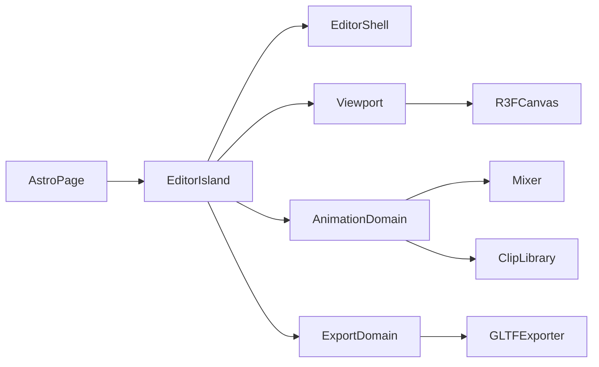

# Design — current

Architecture for the GLB Character & Animation Editor MVP.

## High-level

- [`src/pages/index.astro`](../../src/pages/index.astro) mounts `EditorSidebar` and `EditorPreview` as `client:only="react"` islands
- Domains: `editor-shell`, `viewport`, `animation`, `export` under `src/modules/`

## Assets

| Asset              | Role                                                                                  |
| ------------------ | ------------------------------------------------------------------------------------- |
| Model GLB/GLTF     | Skinned mesh + skeleton; many in the session, **one** previewed in the viewport       |
| Animation GLB/GLTF | Source of `AnimationClip`s only; mesh payload ignored or discarded after clip extract |

Clips are a **shared** library. They bind to the **previewed** model. Track names must resolve to bones/nodes on that skeleton. Mismatch → user-visible error (no retarget). Switching the previewed model re-validates every clip against the new skeleton.

## Model load (US-11)

1. User picks one or more `.glb` / `.gltf` files (File API)
2. Adapter parses each via imperative `GLTFLoader` and a blob URL (`viewport/adapters`)
3. Validate skinned mesh + skeleton per file; else user-visible error and that file does not join the library
4. Append successful loads to `models[]`. First successful load becomes `activeModelId` (previewed); later loads do not steal the preview
5. Viewport mounts only the previewed model’s scene graph. Other library graphs stay in memory until Remove
6. Replace updates that entry only (keep id). If it was previewed, swap the viewport graph and re-frame. Remove disposes that graph / blob URL; if it was previewed, select another loaded model or idle empty state

Empty overlay when idle; clear error copy on parse failure or missing skeleton. After a successful load **or preview switch**, camera frames the previewed model AABB from a fixed three-quarter elevated angle (`computeModelFraming` + `DEFAULT_VIEW_OFFSET` in `viewport/constants/camera.ts`; spacing in `viewport/services/model-framing.ts`).

Sidebar lists each model with Replace / Remove (`AssetEntry`, same pattern as clips). The previewed row is distinct; selecting it sets `activeModelId`, rebinds the mixer, and calls `syncClipsToSkeleton`.

Do not add a second debug canvas, FPS overlay render path, or smoke-test scene that bypasses the editor viewport lifecycle.

## Playback

- One `AnimationMixer` rooted on the model scene graph
- Active clip → one `AnimationAction` (cross-fade later = out of scope)
- Scrubber sets mixer time; Play/Pause/Stop and loop map to action / mixer APIs
- Speed: `mixer.timeScale` for live playback
- Switching active clip stops the previous action and plays the new one

## Animation import

1. User selects one or more `.glb` / `.gltf` files; adapter loads each and collects `animations` into library entries (stable id + display name + clip) — file meshes are never shown
2. Validate each clip's track targets against the loaded character node/skeleton map; missing/unknown bones → the entry is marked errored with user-visible copy (no retargeting, no automatic vendor prefix rewriting)
3. Re-validate entries when the previewed model changes, is replaced, or is removed so stale clips are never silently played on a mismatched rig (`syncClipsToSkeleton`)
4. Sidebar **library** lists each entry with Replace / Remove (same pattern as the model row). Replace re-picks one file and updates **that** entry only (first clip in the file; keep the entry id). Remove drops the entry; if it was active, select the next ready clip or clear selection
5. Preview chrome owns active-clip selection plus Play / Pause / Stop / loop and the scrubber; those controls stay disabled until a model is previewed and at least one valid clip exists for that skeleton
6. Preview layout: viewport fills remaining height (`flex-1 min-h-0`); playback bar is a shrink-to-content footer under the canvas (not a fixed magic height overlapping the scene)

## Trim

1. Clone the active clip's **working** reference — actually trim from the retained **source** clip so the window can always be re-derived against the full original duration
2. `trimClipWindow(source, start, end)` in `animation/services`: per track, `KeyframeTrack.trim(start, end)` keeps in-window keys (plus the first key before `start` for interpolation), then re-baselines track times by `−start` and sets `clip.duration = end − start`. (`AnimationClip.trim()` in three 0.185 is a no-arg helper that only crops to the clip's own duration — it does not take a window)
3. Replace the library entry’s working `clip` with the result (the source clip is never mutated)
4. The pre-trim clip stays recoverable for the session via the entry's `sourceClip` reference (restore control or re-trim from source)

## Time scale on export (US-5 contract)

Playback uses `mixer.timeScale` only. On export, **bake** the current speed into track times / clip duration so the downloaded GLB plays at the edited speed in other viewers (no reliance on runtime `timeScale`).

## Keyframe write (US-4)

1. Pause (or scrub) so `mixer.time` is the target timestamp
2. Raycast → select bone or mesh; attach TransformControls
3. On “Save Keyframe at Current Time”:
   - Read selection local position, quaternion, scale
   - Find or create `VectorKeyframeTrack` / `QuaternionKeyframeTrack` for that node on the active clip
   - Insert or update values at `mixer.time` (keep times sorted)
4. Rebind / update the mixer action so the edit is audible on next play

## Viewport

- Full-bleed R3F `Canvas` with lights; orbit / pan / zoom via `OrbitControls`
- World XYZ axes at the origin with metre rulers on +X/+Y (major `Nm`, minor `0.1` ticks; `viewport/constants/world-axes`) for orientation
- Dark infinite ground grid at `y = 0` (1 m cells, stronger section lines; `viewport/constants/ground-grid`) plus soft contact shadow under the model (`ContactShadows`)
- TransformControls for selected object; modes translate / rotate / scale as needed for keyframe capture
- Collapsible sidebar docks beside the canvas (`editor-shell`); collapse/expand with labelled chevron controls

## Export (US-5)

One “Download” control builds a **zip** in the browser (no server):

1. If there are no loaded models **and** no working clips → disable or error; do not download
2. For each loaded model: `GLTFExporter.parse` (`binary: true`) of that scene plus **only** working library clips that validate against **that** model’s skeleton (pack-time validation — do not reuse the UI `ready` flag, which is relative to the previewed model). Bake `timeScale` into clones when it is not `1`
3. For each library clip that has a working `AnimationClip`: animation-only `.glb` (empty / minimal scene, one clip, same bake). Ignore current preview validation
4. Filename collisions inside the zip get a numeric suffix
5. Trigger a single download of the zip blob. Any exporter or zip failure → user-visible error; no partial archive

A model with no matching clips still ships as a mesh-only `.glb`. There is no “one combined GLB” option and no per-row download buttons.

## Layering rules

- Pure clip math (insert keyframe, sort times, bake scale) in `animation/services` or `utils` without importing `three` types when practical; adapters wrap Three objects at the boundary
- Loaders and exporter live in `adapters/`
- UI state for sidebar vs hot-path mixer time: avoid re-rendering the canvas every frame from React state — prefer refs for mixer clock, promote to state only for labelled UI
