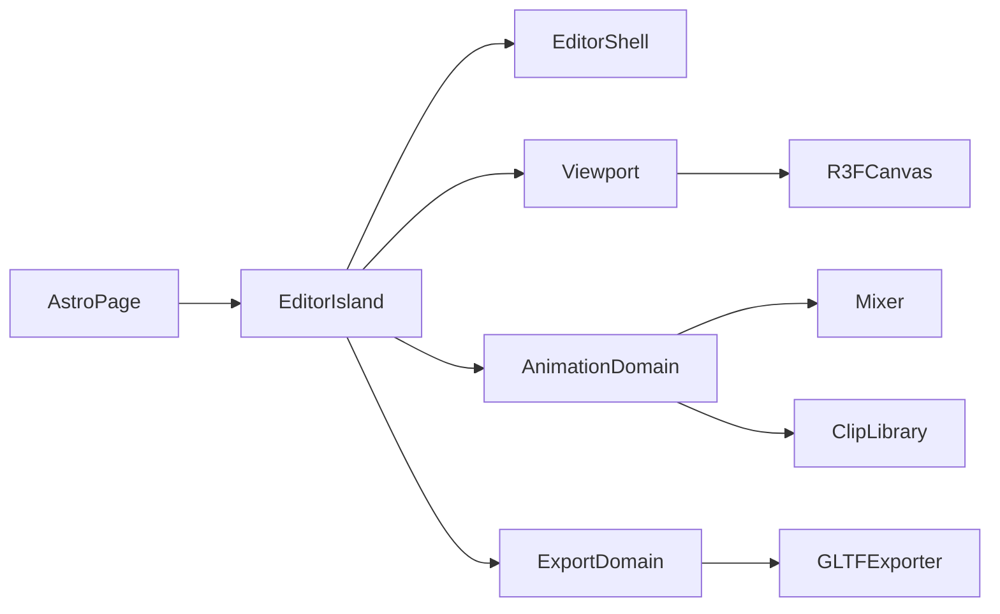

# Design — current

Architecture for the GLB Character & Animation Editor MVP.

## High-level

- [`src/pages/index.astro`](../../src/pages/index.astro) mounts one client React editor island
- Domains: `editor-shell`, `viewport`, `animation`, `export` under `src/modules/`

## Assets

| Asset | Role |
|-------|------|
| Model GLB/GLTF | Skinned mesh + skeleton; single loaded model at a time |
| Animation GLB/GLTF | Source of `AnimationClip`s only; mesh payload ignored or discarded after clip extract |

Clips bind to the loaded model. Track names must resolve to bones/nodes on that skeleton. Mismatch → user-visible error (no retarget).

## Playback

- One `AnimationMixer` rooted on the model scene graph
- Active clip → one `AnimationAction` (cross-fade later = out of scope)
- Scrubber sets mixer time; Play/Pause/Stop and loop map to action / mixer APIs
- Speed: `mixer.timeScale` for live playback

## Trim

1. Clone active clip
2. Call `trim(start, end)` on the clone
3. Replace the library entry’s working clip with the clone
4. Keep the pre-trim clone recoverable for the session (restore control or retain original reference)

## Time scale on export (US-5 contract)

Playback uses `mixer.timeScale` only. On export, **bake** the current speed into track times / clip duration so the downloaded GLB plays at the edited speed in other viewers (no reliance on runtime `timeScale`).

## Keyframe write (US-4)

1. Pause (or scrub) so `mixer.time` is the target timestamp
2. Raycast → select bone or mesh; attach TransformControls
3. On “Save Keyframe at Current Time”:
   - Read selection local position, quaternion, scale
   - Find or create `VectorKeyframeTrack` / `QuaternionKeyframeTrack` for that node on the active clip
   - Insert or update values at `mixer.time` (keep times sorted)
4. Rebind / update the mixer action so the edit is audible on next play

## Viewport

- Full-screen R3F `Canvas`
- World XYZ axes at the origin with metre rulers on +X/+Y (major `Nm`, minor `0.1` ticks; `viewport/constants/world-axes`) for orientation
- OrbitControls (or drei equivalent) for camera
- TransformControls for selected object; modes translate / rotate / scale as needed for keyframe capture
- Collapsible sidebar overlays or docks beside the canvas without shrinking the WebGL buffer unexpectedly (prefer overlay or explicit resize handling)

## Export

- `GLTFExporter` with animations array = all library clips in their current edited form + model scene
- Trigger browser download of `.glb` binary

## Layering rules

- Pure clip math (insert keyframe, sort times, bake scale) in `animation/services` or `utils` without importing `three` types when practical; adapters wrap Three objects at the boundary
- Loaders and exporter live in `adapters/`
- UI state for sidebar vs hot-path mixer time: avoid re-rendering the canvas every frame from React state — prefer refs for mixer clock, promote to state only for labelled UI
