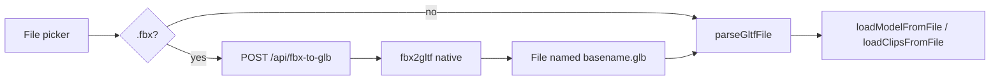

# US-16 design

## Scope

Accept `.fbx` on model and clip import / replace. Convert on the server with `fbx2gltf`, then follow today’s `GLTFLoader` path.

## Approach

### Server

- `@astrojs/vercel` adapter; editor page stays prerendered; only the API is on-demand (`export const prerender = false`)
- Adapter: `includeFiles` for `node_modules/fbx2gltf/bin/Linux/`; `excludeFiles` for Darwin + Windows binaries; `maxDuration` enough for convert (e.g. 60s)
- Do **not** use Edge middleware / Edge runtime for this route
- Thin route `src/pages/api/fbx-to-glb.ts`: `POST` only, `multipart/form-data` field `file`
- Server-only convert module (imported only by that route), e.g. `src/modules/import/services/convert-fbx.ts`:
  - Reject non-`.fbx` and oversize bodies (~4.5MB Vercel payload)
  - Write under `os.tmpdir()` (`/tmp` on Vercel) → `fbx2gltf` `convert(src, dest.glb)` via `createRequire`
  - Return `model/gltf-binary`; `try/finally` delete the temp dir
- Externalize `fbx2gltf` from the Vite SSR bundle
- Domain `import` owns convert API + client adapter; do not import `fbx2gltf` from client islands

### Client

- Shared `ensureGltfFile(file)` used by `loadModelFromFile` and `loadClipsFromFile` (not only the picker, so Replace cannot skip convert)
- `.glb` / `.gltf` returned as-is; `.fbx` → `POST /api/fbx-to-glb` → `new File([blob], basename.glb, { type: 'model/gltf-binary' })`
- File picker `accept` includes `.fbx`; `parseGltfFile` stays GLB/GLTF-only
- No Mixamo-specific convert flags; dest `.glb` is enough. Bone mismatch still uses US-6

### Hosting notes

- Local `astro dev` uses the Darwin binary from `node_modules`; Vercel production uses the Linux binary
- Function body limit typically 4.5MB — clear oversize error until a later blob/chunked strategy
- chmod execute bit on the bundled Linux binary if it is not executable after includeFiles

## Non-goals

No in-browser FBXLoader path. No Edge convert. No silent retarget. No accounts.
