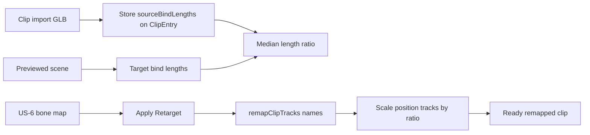

# US-17 design

## Problem

US-6 remaps track **names** only. Mixamo animation GLBs often store local positions in **centimetres** while character GLBs (e.g. Y Bot) use **metres**. Applying cm positions onto a metre skeleton (~100×) collapses the skin into a shard. Missing fingertip `*4` bones are unrelated; skipping them is fine.

## Approach

On Apply, after name remap, scale every remapped `.position` track by one global factor:

```text
ratio = median_i ( ‖targetBone_i.position‖ / ‖sourceBone_i.position‖ )
```

over mapped pairs `i` with both lengths > ε (e.g. `1e-6`). Then `values[j] *= ratio` for each position track. Quaternions / scales untouched.



### Source bind lengths

`loadClipsFromFile` currently discards `gltf.scene`. Capture bone local-position lengths from that scene (same bone set as `buildTargetBoneNames`) into `ClipEntry.sourceBindLengths: Record<string, number>` (raw source bone names → length). Animation-only Mixamo GLBs still include the source armature.

### Ratio at Apply

- Inputs: `mapping`, `entry.sourceBindLengths`, previewed `scene`
- For each mapped `source → target`: if both lengths usable, push `targetLen / sourceLen`
- If no samples → error (do not write clip / do not rename bones on All models)
- Pass `positionScale: ratio` into `remapClipTracks` (or a thin helper called from the retarget handler)

### All models scope

Same remapped clip (one scale vs the **previewed** character). Bone renames on other models stay name-only (US-6). Document that scale is relative to the previewed skeleton; multi-model packs with wildly different sizes remain a later concern.

## Non-goals

No per-track IK. No dropping non-hips positions. No silent import remap. No hardcoded `0.01` — always derive from rest poses.
