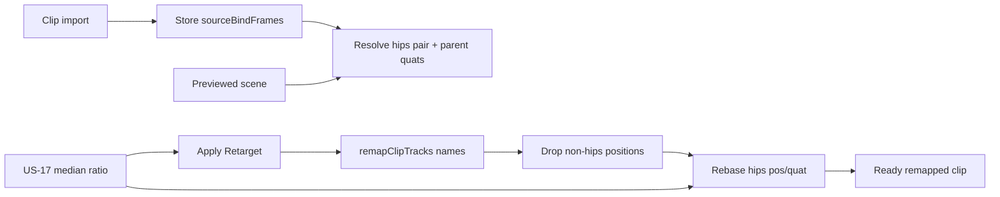

# US-18 design

## Problem

US-17 scales every remapped `.position` by a median rest-pose length ratio. Mixamo animation GLBs from `fbx2gltf` often keep an `Armature` **+90° X** with hips local height on **−Z**, while metre characters like `Y Bot` parent hips under an untilted root with height on **+Y**. Uniform `*= ratio` preserves that axis → after Apply the character lies on the floor.

Limb `.position` tracks are almost always rest offsets; motion lives in quaternions. Applying source limb positions (even scaled) fights the target bind pose.

## Approach

On Apply, after name remap + US-17 ratio:

1. **Drop** every `.position` track except the mapped **hips** bone
2. **Rebase hips** translation and rotation from source parent bind frame into target parent bind frame

```text
p' = R_targetParent⁻¹ * R_sourceParent * (p * ratio)
q' = R_targetParent⁻¹ * R_sourceParent * q
```

`R_*Parent` = parent’s world quaternion at rest (bind), captured on the source GLB at clip load and on the previewed scene at Apply.



### Why hips only for quats

Only the hips bone is parented under the tilted `Armature`. Child bones are parented to other bones; their local quats stay valid across Mixamo→Mixamo name remap.

### Same-hierarchy safety

When `R_sourceParent ≈ R_targetParent`, rebase cancels → `p' ≈ p * ratio`, `q' ≈ q` (US-17-only behavior plus dropped non-hips positions).

### Failure

No mapped hips (or missing source/target bind frame for that pair) while the clip still has `.position` tracks → clear Apply error; no library write / no All-models renames.

## Non-goals

No convert-time axis bake. No full retargeter. No change to median ratio sampling.
