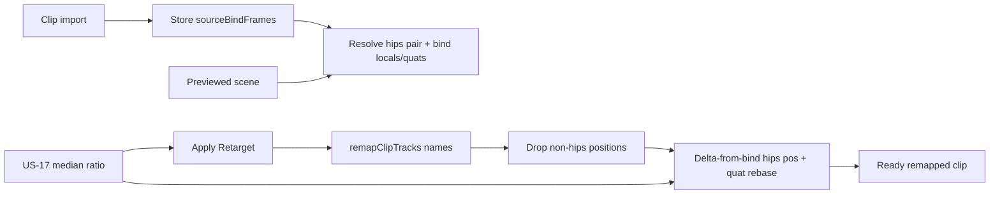

# US-18 design

## Problem

US-17 scales every remapped `.position` by a median rest-pose length ratio. Mixamo animation GLBs from `fbx2gltf` often keep an `Armature` **+90° X** with hips local height on **−Z**, while metre characters like `Y Bot` parent hips under an untilted root with height on **+Y**. Uniform `*= ratio` preserves that axis → after Apply the character lies on the floor.

Limb `.position` tracks are almost always rest offsets; motion lives in quaternions. Applying source limb positions (even scaled) fights the target bind pose.

Absolute rebasing of hips translation (`p' = R⁻¹ · R · (p · ratio)`) fixes the axis but keeps the **source** hip height, so the target character can float.

## Approach

On Apply, after name remap + US-17 ratio:

1. **Drop** every `.position` track except the mapped **hips** bone
2. **Rebase hips** rotation from source parent bind frame into target parent bind frame
3. **Hips translation = target bind + rebased scaled delta from source bind**

```text
Δ  = (p − sourceBindLocal) * ratio
p' = targetBindLocal + R_targetParent⁻¹ * R_sourceParent * Δ
q' = R_targetParent⁻¹ * R_sourceParent * q
```

`R_*Parent` = parent’s world quaternion at rest (bind). Bind locals + parent quats are captured on the source GLB at clip load and on the previewed scene at Apply.



### Why hips only for quats

Only the hips bone is parented under the tilted `Armature`. Child bones are parented to other bones; their local quats stay valid across Mixamo→Mixamo name remap.

### Same-hierarchy safety

When parent orientations match and binds are comparable, `p' ≈ targetBind + (p − sourceBind) * ratio`. Same-unit Mixamo→Mixamo with matching binds stays near the authored path; dropped non-hips positions still apply.

### Failure

No mapped hips (or missing source/target bind frame for that pair) while the clip still has `.position` tracks → clear Apply error; no library write / no All-models renames.

## Non-goals

No convert-time axis bake. No full retargeter. No foot IK / Y = 0 snap. No change to median ratio sampling.
